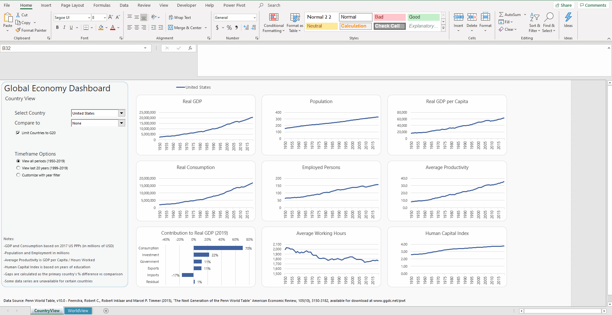

# GlobalEconDashboard
Global economy dashboard in Excel. Based on the Penn World Table, v10.0

Features country-to-country comparison as well as a world rankings.

Requires Office 2016+ and Excel Macros turned on.

<h1 align="left">
  
</h1>

